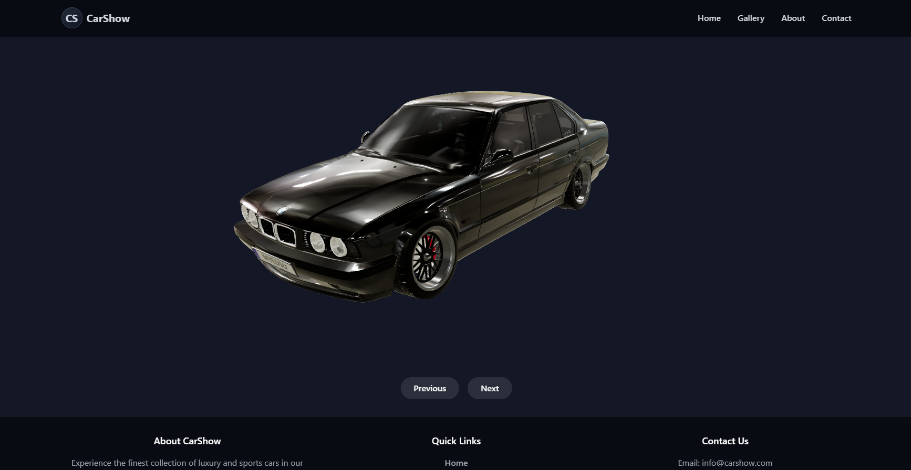

# 🚗 CarShow - Interactive 3D Car Showcase

A modern, interactive web application that showcases high-quality 3D car models in a sleek, dark-themed environment. Built with React, Three.js, and Tailwind CSS.



## ✨ Features

- 🎮 Interactive 3D car models with smooth rotation and user controls
- 🌙 Dark garage-themed environment with realistic lighting
- 🖼️ Multiple car models support (BMW i8, M3 E30, E34)
- 📱 Fully responsive design
- 🎨 Modern UI with Tailwind CSS
- ⚡ Optimized performance with React Three Fiber

## 🛠️ Technologies Used

- React
- TypeScript
- Three.js
- React Three Fiber
- Tailwind CSS
- Vite

## 🚀 Getting Started

### Prerequisites

- Node.js (v14 or higher)
- npm or yarn

### Installation

1. Clone the repository:
```bash
git clone https://github.com/yourusername/car-show.git
cd car-show
```

2. Install dependencies:
```bash
npm install
# or
yarn install
```

3. Start the development server:
```bash
npm run dev
# or
yarn dev
```

4. Open your browser and navigate to `http://localhost:5173`

## 🎨 Project Structure

```
car-show/
├── public/
│   └── models/          # 3D car models
├── src/
│   ├── components/      # React components
│   │   ├── CarModel.tsx # 3D car viewer
│   │   └── ...
│   ├── App.tsx         # Main application
│   └── main.tsx        # Entry point
├── index.html
└── package.json
```

## 🚗 Adding New Car Models

1. Place your GLB format 3D car model in the `public/models/` directory
2. Update the `models` array in `App.tsx` with your new model path
3. The model will automatically be available in the carousel

## 🎯 Features in Detail

### Interactive 3D Viewer
- Smooth auto-rotation when idle
- User-controlled rotation on drag
- Realistic lighting and shadows
- Optimized material properties

### Modern UI
- Responsive header with logo
- Navigation menu
- Car model selector
- Informative footer

## 🤝 Contributing

Contributions are welcome! Please feel free to submit a Pull Request.

## 📝 License

This project is licensed under the MIT License - see the [LICENSE](LICENSE) file for details.

## 🙏 Acknowledgments

- [Three.js](https://threejs.org/) for the 3D rendering engine
- [React Three Fiber](https://github.com/pmndrs/react-three-fiber) for React integration
- [Tailwind CSS](https://tailwindcss.com/) for styling
- [Vite](https://vitejs.dev/) for the build tool

---

Made with ❤️ by [Your Name]
